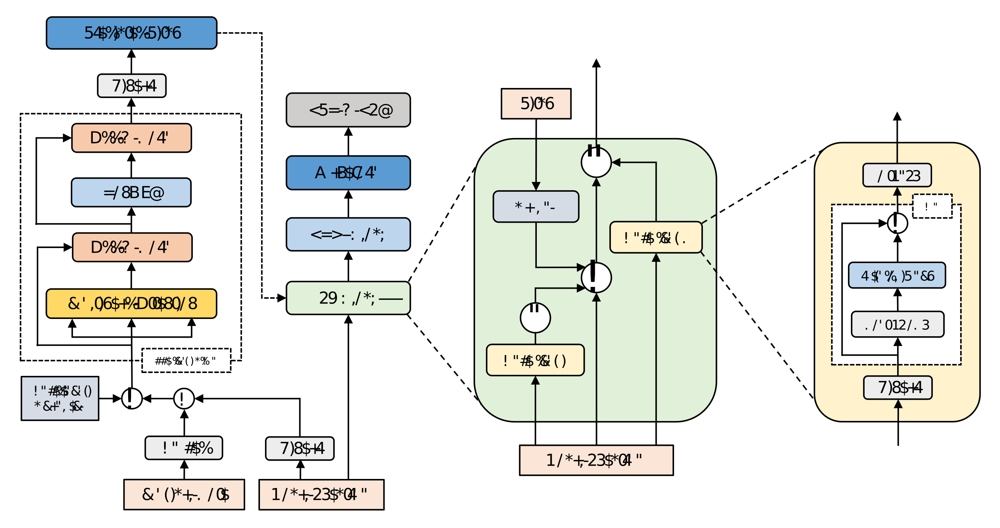

## KARATUNER: TOWARDS END TO END NATURAL PITCH CORRECTION FOR SINGING VOICE IN KARAOKE

### Abstract
An automatic pitch correction system typically includes several stages, such as pitch extraction, deviation estimation, pitch shift processing, and cross-fade smoothing. However, designing these components with strategies often requires domain expertise and they are likely to fail on corner cases. In this paper, we present KaraTuner, an end-to-end neural architecture that predicts pitch curve and resynthesizes the singing voice directly from the tuned pitch and vocal spectrum extracted from the original recordings. Several vital technical points have been introduced in KaraTuner to ensure pitch accuracy, pitch naturalness, timbre consistency, and sound quality. A feed-forward Transformer is employed in the pitch predictor to capture long-term dependencies in the vocal spectrum and musical note. We also develop a pitch-controllable vocoder base on a novel source-filter block and the Fre-GAN architecture. KaraTuner obtains a higher preference than the rule-based pitch correction approach through A/B tests, and perceptual experiments show that the proposed vocoder achieves significant advantages in timbre consistency and sound quality compared with the parametric WORLD vocoder and phase vocoder.

### Architecture

### Vocoder Performance

The song examples we list here are the original performance; the output of KaraTuner; the output of WORLD vocoder; the output of phase vocoder.
### 1.

| Original Recording |
| --- |
| <audio src="audio/aiqingzhuanyi_vocal.mp3" controls></audio> |

| phase vocoder | WORLD vocoder | KaraTuner(proposed) |
| --- | --- | --- |
| <audio src="audio/aiqingzhuanyi_pv.mp3" controls></audio> | <audio src="audio/aiqingzhuanyi_world.mp3" controls></audio> | <audio src="audio/aiqingzhuanyi_ugc.mp3" controls></audio> |

### 2.

| Original Recording |
| --- |
| <audio src="audio/87_0ea518d5a8395b86537e47ef80f9fafc598191ad_vocal.mp3" controls></audio> |

| phase vocoder | WORLD vocoder | KaraTuner(proposed) |
| --- | --- | --- |
| <audio src="audio/87_0ea518d5a8395b86537e47ef80f9fafc598191ad_pv.mp3" controls></audio> | <audio src="audio/87_0ea518d5a8395b86537e47ef80f9fafc598191ad_world.mp3" controls></audio> | <audio src="audio/87_0ea518d5a8395b86537e47ef80f9fafc598191ad_ugc.mp3" controls></audio> |

### 3.

| Original Recording |
| --- |
| <audio src="audio/87_01a518d5fcf161b6537e47ef83f9fafc59812aaf_vocal.mp3" controls></audio> |

| phase vocoder | WORLD vocoder | KaraTuner(proposed) |
| --- | --- | --- |
| <audio src="audio/87_01a518d5fcf161b6537e47ef83f9fafc59812aaf_pv.mp3" controls></audio> | <audio src="audio/87_01a518d5fcf161b6537e47ef83f9fafc59812aaf_world.mp3" controls></audio> | <audio src="audio/87_01a518d5fcf161b6537e47ef83f9fafc59812aaf_ugc.mp3" controls></audio> |

### 4.

| Original Recording |
| --- |
| <audio src="audio/87_1ca718d5ae2b05bc537e47ef83f9fafc5981feaf_vocal.mp3" controls></audio> |

| phase vocoder | WORLD vocoder | KaraTuner(proposed) |
| --- | --- | --- |
| <audio src="audio/87_1ca718d5ae2b05bc537e47ef83f9fafc5981feaf_pv.mp3" controls></audio> | <audio src="audio/87_1ca718d5ae2b05bc537e47ef83f9fafc5981feaf_world.mp3" controls></audio> | <audio src="audio/87_1ca718d5ae2b05bc537e47ef83f9fafc5981feaf_ugc.mp3" controls></audio> |

### 5.

| Original Recording |
| --- |
| <audio src="audio/87_7ca518d56f93f6b8537e47ef80f9fafc59811fae_vocal.mp3" controls></audio> |

| phase vocoder | WORLD vocoder | KaraTuner(proposed) |
| --- | --- | --- |
| <audio src="audio/87_7ca518d56f93f6b8537e47ef80f9fafc59811fae_pv.mp3" controls></audio> | <audio src="audio/87_7ca518d56f93f6b8537e47ef80f9fafc59811fae_world.mp3" controls></audio> | <audio src="audio/87_7ca518d56f93f6b8537e47ef80f9fafc59811fae_ugc.mp3" controls></audio> |

### 6.

| Original Recording |
| --- |
| <audio src="audio/87_41a518d59cc664f8537e47ef83f9fafc598140ac_vocal.mp3" controls></audio> |

| phase vocoder | WORLD vocoder | KaraTuner(proposed) |
| --- | --- | --- |
| <audio src="audio/87_41a518d59cc664f8537e47ef83f9fafc598140ac_pv.mp3" controls></audio> | <audio src="audio/87_41a518d59cc664f8537e47ef83f9fafc598140ac_world.mp3" controls></audio> | <audio src="audio/87_41a518d59cc664f8537e47ef83f9fafc598140ac_ugc.mp3" controls></audio> |

### 7.

| Original Recording |
| --- |
| <audio src="audio/87_46b118d5ef95b69c537e47ef80f9fafc5981d2ae_vocal.mp3" controls></audio> |

| phase vocoder | WORLD vocoder | KaraTuner(proposed) |
| --- | --- | --- |
| <audio src="audio/87_46b118d5ef95b69c537e47ef80f9fafc5981d2ae_pv.mp3" controls></audio> | <audio src="audio/87_46b118d5ef95b69c537e47ef80f9fafc5981d2ae_world.mp3" controls></audio> | <audio src="audio/87_46b118d5ef95b69c537e47ef80f9fafc5981d2ae_ugc.mp3" controls></audio> |

### 8.

| Original Recording |
| --- |
| <audio src="audio/87_78a718d55a56beae537e47ef83f9fafc598151af_vocal.mp3" controls></audio> |

| phase vocoder | WORLD vocoder | KaraTuner(proposed) |
| --- | --- | --- |
| <audio src="audio/87_78a718d55a56beae537e47ef83f9fafc598151af_pv.mp3" controls></audio> | <audio src="audio/87_78a718d55a56beae537e47ef83f9fafc598151af_world.mp3" controls></audio> | <audio src="audio/87_78a718d55a56beae537e47ef83f9fafc598151af_ugc.mp3" controls></audio> |

### 9.

| Original Recording |
| --- |
| <audio src="audio/87_d3a418d57bf39f9e537e47ef80f9fafc59811caf_vocal.mp3" controls></audio> |

| phase vocoder | WORLD vocoder | KaraTuner(proposed) |
| --- | --- | --- |
| <audio src="audio/87_d3a418d57bf39f9e537e47ef80f9fafc59811caf_pv.mp3" controls></audio> | <audio src="audio/87_d3a418d57bf39f9e537e47ef80f9fafc59811caf_world.mp3" controls></audio> | <audio src="audio/87_d3a418d57bf39f9e537e47ef80f9fafc59811caf_ugc.mp3" controls></audio> |

### 10.

| Original Recording |
| --- |
| <audio src="audio/87_dea518d549e0f695537e47ef80f9fafc59810eae_vocal.mp3" controls></audio> |

| phase vocoder | WORLD vocoder | KaraTuner(proposed) |
| --- | --- | --- |
| <audio src="audio/87_dea518d549e0f695537e47ef80f9fafc59810eae_pv.mp3" controls></audio> | <audio src="audio/87_dea518d549e0f695537e47ef80f9fafc59810eae_world.mp3" controls></audio> | <audio src="audio/87_dea518d549e0f695537e47ef80f9fafc59810eae_ugc.mp3" controls></audio> |

### 11.

| Original Recording |
| --- |
| <audio src="audio/87_0dbd18d5623291a9537e47ef80f9fafc59815bad_vocal.mp3" controls></audio> |

| phase vocoder | WORLD vocoder | KaraTuner(proposed) |
| --- | --- | --- |
| <audio src="audio/87_0dbd18d5623291a9537e47ef80f9fafc59815bad_pv.mp3" controls></audio> | <audio src="audio/87_0dbd18d5623291a9537e47ef80f9fafc59815bad_world.mp3" controls></audio> | <audio src="audio/87_0dbd18d5623291a9537e47ef80f9fafc59815bad_ugc.mp3" controls></audio> |

### 12.

| Original Recording |
| --- |
| <audio src="audio/qingfeideyi_vocal.mp3" controls></audio> |

| phase vocoder | WORLD vocoder | KaraTuner(proposed) |
| --- | --- | --- |
| <audio src="audio/qingfeideyi_pv.mp3" controls></audio> | <audio src="audio/qingfeideyi_world.mp3" controls></audio> | <audio src="audio/qingfeideyi_ugc.mp3" controls></audio> |

### 13.

| Original Recording |
| --- |
| <audio src="audio/87_3ea218d54bf93fba537e47ef80f9fafc5981e9ac_vocal.mp3" controls></audio> |

| phase vocoder | WORLD vocoder | KaraTuner(proposed) |
| --- | --- | --- |
| <audio src="audio/87_3ea218d54bf93fba537e47ef80f9fafc5981e9ac_pv.mp3" controls></audio> | <audio src="audio/87_3ea218d54bf93fba537e47ef80f9fafc5981e9ac_world.mp3" controls></audio> | <audio src="audio/87_3ea218d54bf93fba537e47ef80f9fafc5981e9ac_ugc.mp3" controls></audio> |

### Pitch Predictor Examples

The song examples we list here are the original performance, the output of the baseline tuning method (post tuning process in [A Neural Parametric Singing Synthesizer](https://arxiv.org/abs/1704.03809), NPSS) and the output of KaraTuner.

### 1.

| Original Recording |
| --- |
| <audio src="audio/aiqingzhuanyi_vocal.mp3" controls></audio> |

| NPSS | KaraTuner(proposed) |
| --- | --- |
| <audio src="audio/aiqingzhuanyi_npss.mp3" controls></audio> | <audio src="audio/aiqingzhuanyi_ugc.mp3" controls></audio> |

### 2.

| Original Recording |
| --- |
| <audio src="audio/87_0ea518d5a8395b86537e47ef80f9fafc598191ad_vocal.mp3" controls></audio> |

| NPSS | KaraTuner(proposed) |
| --- | --- |
| <audio src="audio/87_0ea518d5a8395b86537e47ef80f9fafc598191ad_npss.mp3" controls></audio> | <audio src="audio/87_0ea518d5a8395b86537e47ef80f9fafc598191ad_ugc.mp3" controls></audio> |

### 3.

| Original Recording |
| --- |
| <audio src="audio/87_01a518d5fcf161b6537e47ef83f9fafc59812aaf_vocal.mp3" controls></audio> |

| NPSS | KaraTuner(proposed) |
| --- | --- |
| <audio src="audio/87_01a518d5fcf161b6537e47ef83f9fafc59812aaf_npss.mp3" controls></audio> | <audio src="audio/87_01a518d5fcf161b6537e47ef83f9fafc59812aaf_ugc.mp3" controls></audio> |

### 4.

| Original Recording |
| --- |
| <audio src="audio/87_1ca718d5ae2b05bc537e47ef83f9fafc5981feaf_vocal.mp3" controls></audio> |

| NPSS | KaraTuner(proposed) |
| --- | --- |
| <audio src="audio/87_1ca718d5ae2b05bc537e47ef83f9fafc5981feaf_npss.mp3" controls></audio> | <audio src="audio/87_1ca718d5ae2b05bc537e47ef83f9fafc5981feaf_ugc.mp3" controls></audio> |

### 5.

| Original Recording |
| --- |
| <audio src="audio/87_7ca518d56f93f6b8537e47ef80f9fafc59811fae_vocal.mp3" controls></audio> |

| NPSS | KaraTuner(proposed) |
| --- | --- |
| <audio src="audio/87_7ca518d56f93f6b8537e47ef80f9fafc59811fae_npss.mp3" controls></audio> | <audio src="audio/87_7ca518d56f93f6b8537e47ef80f9fafc59811fae_ugc.mp3" controls></audio> |

### 6.

| Original Recording |
| --- |
| <audio src="audio/87_41a518d59cc664f8537e47ef83f9fafc598140ac_vocal.mp3" controls></audio> |

| NPSS | KaraTuner(proposed) |
| --- | --- |
| <audio src="audio/87_41a518d59cc664f8537e47ef83f9fafc598140ac_npss.mp3" controls></audio> | <audio src="audio/87_41a518d59cc664f8537e47ef83f9fafc598140ac_ugc.mp3" controls></audio> |

### 7.

| Original Recording |
| --- |
| <audio src="audio/87_46b118d5ef95b69c537e47ef80f9fafc5981d2ae_vocal.mp3" controls></audio> |

| NPSS | KaraTuner(proposed) |
| --- | --- |
| <audio src="audio/87_46b118d5ef95b69c537e47ef80f9fafc5981d2ae_npss.mp3" controls></audio> | <audio src="audio/87_46b118d5ef95b69c537e47ef80f9fafc5981d2ae_ugc.mp3" controls></audio> |

### 8.

| Original Recording |
| --- |
| <audio src="audio/87_78a718d55a56beae537e47ef83f9fafc598151af_vocal.mp3" controls></audio> |

| NPSS | KaraTuner(proposed) |
| --- | --- |
| <audio src="audio/87_78a718d55a56beae537e47ef83f9fafc598151af_npss.mp3" controls></audio> | <audio src="audio/87_78a718d55a56beae537e47ef83f9fafc598151af_ugc.mp3" controls></audio> |

### 9.

| Original Recording |
| --- |
| <audio src="audio/87_d3a418d57bf39f9e537e47ef80f9fafc59811caf_vocal.mp3" controls></audio> |

| NPSS | KaraTuner(proposed) |
| --- | --- |
| <audio src="audio/87_d3a418d57bf39f9e537e47ef80f9fafc59811caf_npss.mp3" controls></audio> | <audio src="audio/87_d3a418d57bf39f9e537e47ef80f9fafc59811caf_ugc.mp3" controls></audio> |

### 10.

| Original Recording |
| --- |
| <audio src="audio/87_dea518d549e0f695537e47ef80f9fafc59810eae_vocal.mp3" controls></audio> |

| NPSS | KaraTuner(proposed) |
| --- | --- |
| <audio src="audio/87_dea518d549e0f695537e47ef80f9fafc59810eae_npss.mp3" controls></audio> | <audio src="audio/87_dea518d549e0f695537e47ef80f9fafc59810eae_ugc.mp3" controls></audio> |

### 11.

| Original Recording |
| --- |
| <audio src="audio/87_0dbd18d5623291a9537e47ef80f9fafc59815bad_vocal.mp3" controls></audio> |

| NPSS | KaraTuner(proposed) |
| --- | --- |
| <audio src="audio/87_0dbd18d5623291a9537e47ef80f9fafc59815bad_npss.mp3" controls></audio> | <audio src="audio/87_0dbd18d5623291a9537e47ef80f9fafc59815bad_ugc.mp3" controls></audio> |

### 12.

| Original Recording |
| --- |
| <audio src="audio/qingfeideyi_vocal.mp3" controls></audio> |

| NPSS | KaraTuner(proposed) |
| --- | --- |
| <audio src="audio/qingfeideyi_npss.mp3" controls></audio> | <audio src="audio/qingfeideyi_ugc.mp3" controls></audio> |

### 13.

| Original Recording |
| --- |
| <audio src="audio/87_3ea218d54bf93fba537e47ef80f9fafc5981e9ac_vocal.mp3" controls></audio> |

| NPSS | KaraTuner(proposed) |
| --- | --- |
| <audio src="audio/87_3ea218d54bf93fba537e47ef80f9fafc5981e9ac_npss.mp3" controls></audio> | <audio src="audio/87_3ea218d54bf93fba537e47ef80f9fafc5981e9ac_ugc.mp3" controls></audio> |
